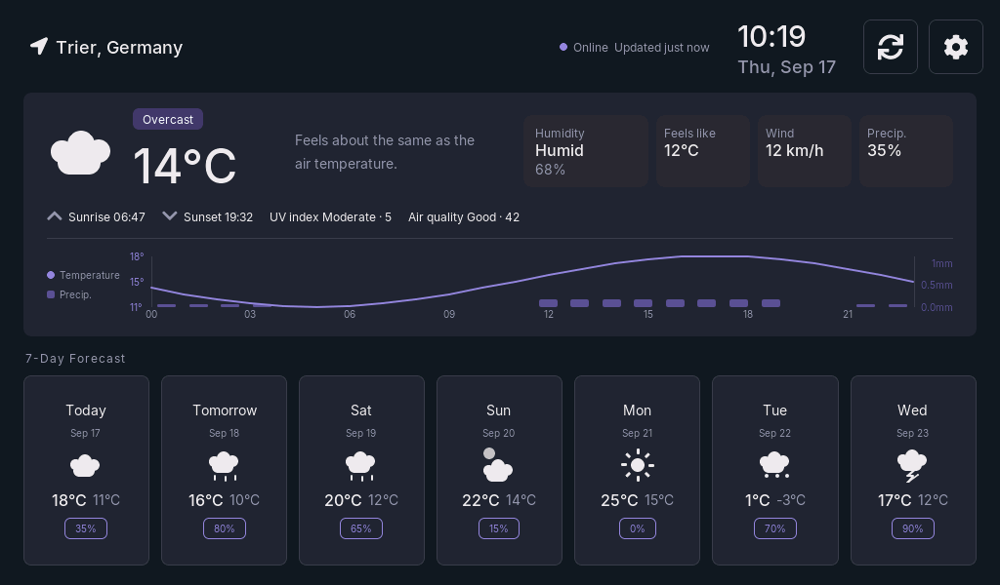
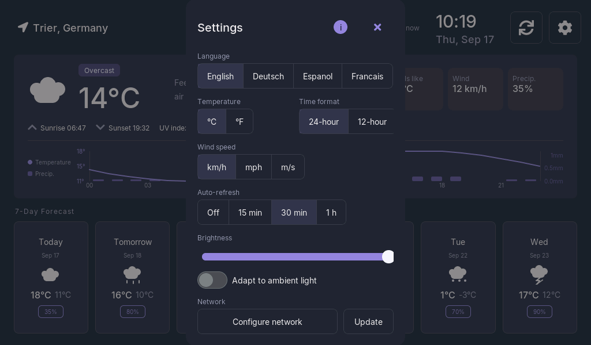

# Weather Display — ESP32-P4 firmware

A 7-day weather display for the **Waveshare ESP32-P4-WIFI6-Touch-LCD-7B**
(1024×600 MIPI-DSI, GT911 touch). The interface is the "Weather App" design from
Claude Design, ported to LVGL 9; the data is live from
[Open-Meteo](https://open-meteo.com) (no API key required).

Everything is operable from the touchscreen alone — including joining a Wi-Fi
network and installing firmware updates — so the device never needs a serial
cable after the first flash.

| Main screen | Settings |
|---|---|
|  |  |

Screenshots are from the host simulator (`./scripts/sim.sh --screen main`),
which renders the same LVGL UI source the firmware does — see
[Host simulator](#host-simulator) below.

## Features

- Current conditions, 7-day forecast strip, and a slide-up per-day detail
  panel with an hourly temperature + precipitation chart.
- Sunrise/sunset, UV index, and air quality (from a separate Open-Meteo
  endpoint) on the current-conditions card.
- Up to three favorite cities, alongside city search over Open-Meteo's
  geocoding API with the on-screen keyboard.
- Adaptive brightness from the board's optional OV5647 camera (ambient light
  → backlight), with a settling/EMA policy tuned to avoid flicker. Absent
  gracefully if no camera is fitted.
- On-device Wi-Fi setup: scan, pick a network, type the passphrase, or enter a
  hidden SSID by hand. Credentials persist in NVS.
- On-device firmware updates: checks a GitHub Release's manifest, downloads
  and flashes the ESP32-P4 image over HTTPS with a SHA-256 check against the
  manifest, and optionally updates the ESP32-C6 Wi-Fi coprocessor too — see
  [Firmware updates](#firmware-updates).
- Device Info dialog: firmware/coprocessor versions, hardware revision,
  network details, last successful sync.
- Settings: language (EN/DE/ES/FR), °C/°F, km/h · mph · m/s, 12/24-hour clock,
  auto-refresh interval. All of it persists across reboots.
- Header shows online/offline and warns when data is more than an hour stale.

## Layout

```
main/
├── main.c                display + Wi-Fi bring-up, wiring
├── app_wifi.c/h          station, scanning, runtime provisioning, SNTP
├── app_weather.c/h       Open-Meteo forecast + geocoding worker task, OTA dispatch
├── app_favorites.c/h     favorite-city slots (thin adapter over app_logic/favorites)
├── app_light.c/h         camera-driven adaptive brightness (V4L2/esp_video)
├── app_prefs.c/h         NVS-backed settings and selected city
├── app_format.c/h        locale dates/times and the "real feel" sentence
├── ota_update.c/h        dual-chip OTA: manifest fetch, HTTPS flash, esp-hosted RPC OTA
├── storage_backend_nvs.c/h  NVS implementation of app_logic's storage_backend_t
├── save_debounce.c/h     coalesces rapid settings writes into one NVS commit
├── ui_fonts.h            Inter ⇄ Montserrat font mapping
├── weather_chart.c/h     hourly temperature + precipitation chart
├── weather_ui.c/h        ── imported from Claude Design ──
├── weather_icons.c/h     ── imported from Claude Design ──
├── weather_i18n.c/h      ── imported from Claude Design ──
└── fonts/                generated Inter faces (tools/gen_fonts.sh)

components/app_logic/     hardware-free application logic, host-tested (see Testing)
├── favorites.c           favorite-slot selection logic
├── light_policy.c        ambient-light EMA/threshold policy for app_light.c
├── storage_record.c      versioned NVS record round-trip, over storage_backend.h
├── weather_forecast_parse.c   Open-Meteo JSON → plain struct
├── ota_manifest_parse.c  manifest.json → plain struct
└── ota_version_compare.c semver-ish "is remote newer" comparison

host_test/                Unity tests for components/app_logic/, run on the Linux target
sim/                       LVGL UI ported to desktop SDL, no board or emulator needed
scripts/                   host-test.sh, emu-test.sh, hw-flash.sh, sim.sh (see Testing)
```

### Imported vs. authored

`weather_ui`, `weather_icons` and `weather_i18n` come from the design project's
`lvgl_export/` directory and should be **re-synced from Claude Design** rather than
edited freely. Local changes to them are all marked with a `FIX:` comment so a
future pull stays a readable merge. Everything else is firmware written here.

`components/app_logic/` is a stricter boundary than "everything else": no IDF
headers, no `driver/`, no `freertos/`, no registers — time and I/O come in
through small callback structs (e.g. `storage_backend_t`) so the same code
compiles and runs on a desktop Linux target under `host_test/`. New parsing,
state-machine, or protocol logic belongs here, not in `main/`.

## Build

Built and verified against **ESP-IDF v6.1**. The dual-chip release workflow
(`.github/workflows/Manual_Dual-Chip_Release_Build.yml`) also builds against
v6.1. Earlier v6.x should work but isn't actively tested.

Note for IDF 6: cJSON is no longer bundled in IDF core, so it is pulled from the
component registry as `espressif/cjson` (already declared in
`main/idf_component.yml`).

```sh
idf.py set-target esp32p4
idf.py menuconfig      # optional: default city, refresh interval, fallback Wi-Fi
idf.py build flash monitor
```

Dependencies resolve automatically through the component manager
(`main/idf_component.yml`): the Waveshare BSP `3.0.1`, LVGL `9.5.0`,
`esp_hosted`/`esp_wifi_remote` for the radio, and `esp_video`/`esp_cam_sensor`
for the optional camera.

### First boot

The ESP32-P4 has no radio of its own — Wi-Fi runs over SDIO to the on-board
ESP32-C6. On a device with no stored network, the Wi-Fi setup screen opens by
itself; pick a network and type the passphrase. Credentials go to NVS, so it only
happens once. You can also pre-seed a network under
*Weather Display Configuration → Fallback WiFi SSID* if you prefer.

## Firmware updates

Settings → Network → **Update** opens a dialog that checks the latest
[GitHub Release](https://github.com/thomas-engineering/weather_display/releases)
for this repository:

1. Fetches the release's `manifest.json` (version + SHA-256 of each binary).
2. If the manifest's version is newer than the running firmware
   (`components/app_logic/ota_version_compare.c`), downloads `firmware_p4.bin`
   over HTTPS via `esp_https_ota()`, then re-reads the flashed partition and
   verifies its SHA-256 against the manifest before rebooting into it —
   `esp_https_ota()` validates the image header itself, but knows nothing
   about the externally-published hash.
3. On the next boot, if the "Update Wi-Fi coprocessor with application"
   toggle is on, streams `esp32c6_hosted_slave.bin` to the ESP32-C6 over
   esp-hosted's own RPC OTA path, verifies it the same way, and reboots both
   chips to resync before marking the new P4 image valid
   (`esp_ota_mark_app_valid_cancel_rollback()` — an update that never gets
   this far rolls back automatically on the next reset).

The update runs on its own task, off the UI worker, so search/refresh/Wi-Fi
stay responsive during a download; a Cancel tap requests a cooperative abort.
An optional silent check runs every 12 hours if the "Auto-update" toggle is
on, and won't reboot into a freshly-flashed image while a dialog is open on
screen.

Releases are built by `.github/workflows/Manual_Dual-Chip_Release_Build.yml`
(manual `workflow_dispatch`), which builds both chips' firmware from this
repo and the pinned `esp_hosted` version's matching coprocessor example, and
publishes `firmware_p4.bin` + `esp32c6_hosted_slave.bin` + `manifest.json` to
a release tagged from `version.txt`.

## Fonts

The design specifies **Inter**. LVGL's built-in Montserrat faces cover ASCII only,
which would leave holes in every accented word in the German, Spanish and French
string tables (`Überwiegend`, `bewölkt`, `Sensación`, `dégagé`, …). So the build
ships generated Inter faces with the full Latin-1 supplement, in the design's own
weights — Regular (400) for captions, Medium (500) for display sizes.

They are already generated in `main/fonts/`. To regenerate (Node required):

```sh
# Inter is SIL OFL 1.1: https://github.com/rsms/inter/releases
tools/gen_fonts.sh ~/Downloads/inter/extras/ttf
```

`LV_SYMBOL_*` glyphs (the GPS pin, refresh, settings icons) are FontAwesome
codepoints that exist **only** in the Montserrat builds, so those specific labels
keep `FONT_SYMBOL`. That is why the header's location line is two labels rather
than one. Setting `CONFIG_WEATHER_USE_INTER_FONTS=n` falls back to Montserrat
everywhere and makes the app English-only in practice.

## Testing

Four layers, matched to what each one can actually catch — see `CLAUDE.md` for
the full rationale. In order of speed:

| Changed | Run | Time |
|---|---|---|
| `components/app_logic/**` | `./scripts/host-test.sh` | ~5 s |
| `main/**`, drivers, startup, sdkconfig | `./scripts/emu-test.sh` | ~60 s |
| UI rendering (`weather_ui.c`, `weather_chart.c`, `weather_icons.c`, `weather_i18n.c`, fonts) | `./scripts/sim.sh --screen <name> --screenshot <file.bmp>` | ~5 s |
| Peripherals (display, camera, SDMMC, ESP-Hosted) | `./scripts/hw-flash.sh [/dev/ttyACM0]` | ~30 s |

- **`host_test/`** runs Unity tests for every `components/app_logic/` module
  natively on the Linux target — no chip, no emulator. This is where
  manifest/JSON parsing, version comparison, favorites logic, and the
  ambient-light policy are actually verified.
- **The emulator** (`build-emu/`, via `esp-emu`) covers CPU, memory, UART,
  GPIO, timers, SPI flash and GDMA on real ROM behavior, but not PSRAM
  timing, MIPI-DSI, or any attached peripheral — so it's for `main/` logic
  and startup, not display or camera code.
- **`sim/`** builds the UI layer (`weather_ui.c`, `weather_chart.c`,
  `weather_icons.c`, `weather_i18n.c`, `app_format.c`) against desktop LVGL
  at the same resolution and color depth, in an SDL window — see
  [Host simulator](#host-simulator).
- **`hw-flash.sh`** is the only way to verify DSI timing, the camera, SDMMC,
  ESP-Hosted, or anything below `display_port_dsi.c` — it builds, flashes,
  and reads the boot log with a timeout, never using `idf.py monitor`
  (interactive, breaks without a real TTY).

None of the first three prove the firmware boots on the actual board — the
OTA download/flash path and the coprocessor RPC path in particular are
hardware-only, since neither the emulator nor the simulator has a real
network or a second chip to talk to.

### Host simulator

`sim/` opens the UI in a 1024×600 SDL window — no board, no emulator. It
compiles the same `weather_ui.c`, `weather_chart.c`, `weather_icons.c`,
`weather_i18n.c` and `app_format.c` the firmware does, against the same
vendored LVGL 9.5 at the same color depth, and stands in for `main.c` +
`app_weather.c` with fixture data and fake geocoding, Wi-Fi scan/connect, and
OTA progress.

```sh
./scripts/sim.sh                              # interactive: mouse is the touchscreen
./scripts/sim.sh --screen settings            # open one screen straight away
./scripts/sim.sh --shots shots/               # capture all screens as PNG
```

Screens: `main`, `search`, `settings`, `settings-adaptive-on`, `device-info`,
`forecast-icon-tap`, `refresh-toast`, `detail`, `wifi`,
`wifi-forget-confirm`, `favorite-tap`, `ota`, `ota-done`, plus the first-boot
state via `--wifi-setup`. The capture path is headless
(`SDL_VIDEODRIVER=dummy`), so it works over SSH. Screens are opened by
walking the object tree for a known label and clicking its owner, not by
clicking fixed coordinates — a layout change moves the target without
breaking the capture.

What it does **not** show: DSI timing, PPA rotation, the tear-avoid mode, LVGL
buffer sizes, PSRAM throughput, the real panel's color behavior, or any real
network activity (Wi-Fi, HTTP, OTA downloads are all fixtures here).

Run it from any directory — the script resolves the repo from its own path. It
builds for the host, so a cross-toolchain ahead of `/usr/bin` on `PATH` breaks
it: gcc passes `--64` to an `as` that only knows RISC-V or Xtensa. The ESP
toolchains ship an unprefixed `as` under `<toolchain>/<target>/bin/`, which is
where that usually comes from. `sim.sh` probes the compiler first and says so
rather than letting binutils explain it; `which -a as gcc` confirms it.

## Comparing against the design

`tools/extract-design.mjs` renders `design/src/weather-app/Weather App.dc.html`
in headless Chrome and diffs it against the simulator's own screenshots, so
"does the port match the design" becomes a file instead of a memory.

```sh
./scripts/sim.sh --shots shots            # the LVGL side
node tools/extract-design.mjs --vendor    # once: fetch the React UMD builds
node tools/extract-design.mjs --compare shots
```

It writes `design-<screen>.png` and `compare-<screen>.png` into `shots-design/`
for each screen it knows about. Each comparison sheet stacks design, LVGL and a
`mix-blend-mode: difference` overlay where anything the two agree on goes black.

No npm dependencies: Chrome is driven through its own `--screenshot` flag and
does the pixel diff itself. Two things the script has to work around, both
documented at the top of it — the design is not a standalone page (its canvas
runtime needs `window.React` before it boots) and it pulls `WeatherIcon.dc.html`
with `fetch()`, which CORS blocks under `file://`, so it is served over a
throwaway localhost server instead.

Screens are opened by patching the design component's initial
`state = { ... }` block (`SCREENS` at the top of the script), not by clicking —
deterministic, and it survives a re-layout of the controls that would open them.
If the design renames a state field the script fails loudly rather than
screenshotting the wrong screen. Simulator-only states (first-boot Wi-Fi setup,
OTA dialog, device info) have no counterpart in the design and are skipped.

Note the design fetches live weather from Open-Meteo on mount, so its numbers are
the real forecast while the simulator shows fixtures — compare layout, not values.

## The chart

The design's HTML original drew the temperature line and the precipitation bars on
one plot with two independent y-scales. Two scales on one frame invent a
correlation that isn't in the data, so this port keeps the same visual intent but
stacks two panels sharing a single x-axis — each panel then carries one series
against one scale. Bars and line points are placed from the same x coordinates, so
the panels stay in register.

## Threading

LVGL is not thread-safe. Rules:

- Everything touching LVGL runs under `bsp_display_lock()` / `bsp_display_unlock()`,
  and nothing that can block (network I/O, cross-chip RPC, flash writes) runs
  while that lock is held — a synchronous coprocessor-version RPC once did,
  and briefly stalled the LVGL renderer on every render as a result.
- No UI callback blocks. Each one posts a command to the `weather` worker task,
  which owns HTTP, TLS, JSON, Wi-Fi scanning/connecting, and dispatches OTA
  work to its own dedicated task rather than running it inline — a multi-MB
  download must not make search, refresh, or Wi-Fi unresponsive for its
  duration.
- The camera's sampling task shuts itself down at a clean checkpoint between
  samples rather than being deleted from another task's context, so it never
  races a driver ioctl mid-transaction.

City-search keystrokes are debounced by 450 ms in the worker, so typing a name is
one request rather than one TLS handshake per character.

## Verification status

- **Builds clean** with ESP-IDF v6.1 for `esp32p4` — no warnings from any file in
  `main/`. Image is ~2.0 MB, leaving about three-quarters of each 8 MB `ota_0`/`ota_1`
  app slot free.
- **Runs on the physical board, end to end**: on-screen Wi-Fi provisioning (scan →
  passphrase on the built-in keyboard → connect), credentials persisted to NVS,
  SNTP clock sync, and a live Open-Meteo fetch.
- **A real over-the-air update has been completed on hardware**: the device
  fetched a published GitHub Release, downloaded and flashed a newer P4
  image over HTTPS, verified its SHA-256 against the manifest, and rebooted
  into it successfully. The ESP32-C6 coprocessor OTA path has not yet been
  exercised on hardware.
- **Host-run unit tests** (`./scripts/host-test.sh`) cover every
  `components/app_logic/` module — forecast parsing, OTA manifest parsing,
  version comparison, favorites, and the ambient-light policy — all passing.
- **Touch geometry verified by measurement** — corner taps land within ~45 px of
  the true corners on a 1024×600 panel.
- All generated Inter faces are confirmed linked into the ELF.

**Still unverified:** the ESP32-C6 coprocessor OTA path (implemented, modeled
on esp-hosted's own reference example, never exercised end to end), and the
finer visual detail against a physical photo of the panel — specifically
whether the generated Inter faces render the German/Spanish/French accented
characters correctly on the real display.

If taps ever land in the wrong place on a different unit, build with
`CONFIG_WEATHER_TOUCH_DEBUG=y`, tap the four corners, and read the reported
coordinates off the console rather than guessing at flag combinations.

### Hardware gotchas

This board's P4 is **silicon revision v1.3**, so `sdkconfig.defaults` uses the
vendor's `rev1_3` profile. A rev3_x image is refused at flash time — do not pass
`--force`, rebuild with the right profile.

`esp_hosted` is pinned to `3.0.*` and `esp_wifi_remote` to `1.6.*`, which is **not**
what the Waveshare examples use. Their pins (`1.4.*` / `==1.2.5`) double-start the
STA netif on IDF 6 and boot-loop on an lwip `netif already added` assert. If
you change these versions, delete `sdkconfig` — stale esp_hosted values persist,
including the SDIO reset polarity.

The boot log carries one benign error: `major version mismatch — OTA coprocessor
from host` (host esp-hosted 3.0.7 vs the C6's 2.6.7 firmware). Everything works;
updating the co-processor firmware (see [Firmware updates](#firmware-updates))
would silence it.

This P4's ECDSA hardware peripheral isn't available on rev 1.3 silicon, so
mbedTLS's PSA driver logs `ECDSA peripheral not supported on this chip
revision` at `ESP_LOGE` on TLS handshakes that verify an ECDSA-signed
certificate. This is a graceful, automatic fallback to software ECDSA, not a
failure — the handshake completes right after.

The GT911 touch controller's interrupt line is only routed to a test point on
the PCB (net `INT_TP`: FPC connector J3 pin 4 and test point TP1 — no
microcontroller pin), confirmed from the schematic in
`docs/hardware/ESP32-P4-WIFI6-Touch-LCD-7B-schematic.pdf`. That's why touch
runs in polling mode (`BSP_LCD_TOUCH_INT` is `GPIO_NUM_NC` in the vendor BSP) —
interrupt-driven touch isn't possible on this board without a hardware rework.

The camera module has no power-down or reset pin wired to the P4
(`esp_video_init_csi_config_t`'s `pwdn_pin`/`reset_pin` are both `-1`), so
`app_light.c` keeps the CSI stream running continuously while adaptive
brightness is on rather than duty-cycling it per sample — a per-sample
stop/start cycle was tried and hung this 2-buffer driver's DQBUF queue on
real hardware.

## Licenses

This project's own code (`main/`, `components/`, `sim/`, `host_test/`,
`scripts/`) is licensed under the **Apache License 2.0** — see `LICENSE`.

It builds on ESP-IDF and a number of components pulled in through the IDF
Component Manager (`main/idf_component.yml`), each under its own license:

| Component | License |
|---|---|
| ESP-IDF (framework) | Apache-2.0 |
| FreeRTOS-Kernel (bundled in ESP-IDF) | MIT |
| mbedTLS (bundled in ESP-IDF) | Apache-2.0 OR GPL-2.0-or-later (dual) |
| lwIP (bundled in ESP-IDF) | BSD-3-Clause-style |
| Unity (bundled in ESP-IDF, used by `host_test/`) | MIT |
| `waveshare/esp32_p4_wifi6_touch_lcd_7b` (board BSP) | Apache-2.0 |
| `lvgl/lvgl` | MIT |
| `espressif/esp_wifi_remote` | Apache-2.0 |
| `espressif/esp_hosted` | Apache-2.0, with `common/eh_common` and `common/eh_tlv` dual-licensed GPL-2.0-only OR Apache-2.0 (electable), and a bundled BSD-3-Clause `protobuf-c` |
| `espressif/cjson` | MIT |
| `espressif/esp_video` | Espressif MIT |
| `espressif/esp_cam_sensor` | Apache-2.0 |
| `espressif/esp_ipa` | Espressif MIT |
| `espressif/esp_sccb_intf`, `esp_lvgl_adapter`, `esp_lcd_touch`, `esp_lcd_touch_gt911`, `esp_lcd_ek79007`, `esp_lv_fs`, `esp_lv_decoder`, `esp_mmap_assets`, `button`, `knob`, `cmake_utilities`, `eppp_link`, `esp_serial_slave_link`, `esp_codec_dev`, `wifi_remote_over_eppp` | Apache-2.0 |
| `espressif/esp_new_jpeg` | Espressif MIT |
| `espressif/freetype`, `libpng`, `zlib`, `usb`, `usb_host_uvc` | Present in the resolved dependency tree (transitive, optional decoder paths) but not required by this project's `main/CMakeLists.txt` and not compiled into the firmware |

The **Inter** typeface used to generate `main/fonts/inter_*.c`
(`tools/gen_fonts.sh`) is licensed under the **SIL Open Font License 1.1**.
Fallback glyphs come from LVGL's built-in Montserrat font (MIT).

### Weather and air-quality data

This is separate from the code licenses above: it covers the *data* the
firmware fetches at runtime from [Open-Meteo](https://open-meteo.com), not
any software. Open-Meteo's forecast and air-quality data is
[licensed under CC BY 4.0](https://open-meteo.com/en/license) — **free for
non-commercial use**, provided the source is attributed, which is why the
Device Info dialog carries an on-device attribution note
(`Using Data from Open-Meteo.com and OpenAQ.org...`, `main/app_weather.c`).
This firmware only ever calls Open-Meteo's free, non-commercial,
attribution-based endpoints (`api.open-meteo.com`,
`geocoding-api.open-meteo.com`, `air-quality-api.open-meteo.com`) — no API
key is configured or required for this use.

**Commercial use is not covered by CC BY 4.0.** If you deploy this firmware
(or fork it) as part of a commercial product or service, Open-Meteo requires
a separate paid API plan and a commercial API key — see
[open-meteo.com/en/pricing](https://open-meteo.com/en/pricing) — and you are
responsible for obtaining one and updating the API host/key accordingly;
this project does not include or arrange one.
